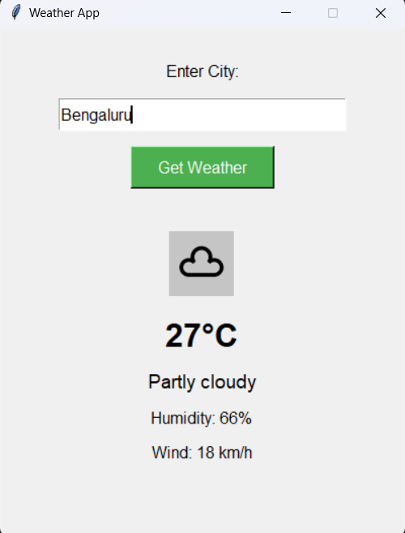

# Weather App

A simple weather application built with Python and Tkinter that displays weather information for any city using the weatherstack API.

## 🖼️ Screenshot

### Main Screen



## Features

- Enter any city name to get current weather information
- Displays temperature in Celsius
- Shows weather condition and description
- Displays humidity percentage
- Shows wind speed
- Displays weather icon
- Error handling for invalid cities

## Requirements

- Python 3.x
- Tkinter (usually comes with Python)
- requests
- Pillow (PIL)

## Installation

1. Clone or download this repository
2. Install the required packages:
   ```
   pip install -r requirements.txt
   ```

## Usage

1. Get your API key from [weatherstack](https://weatherstack.com/)
2. Replace `YOUR_API_KEY` in `weather_app.py` with your actual API key
3. Run the application:
   ```
   python weather_app.py
   ```
4. Enter a city name and click "Get Weather"

## Note

Make sure you have an active internet connection to fetch weather data. 
